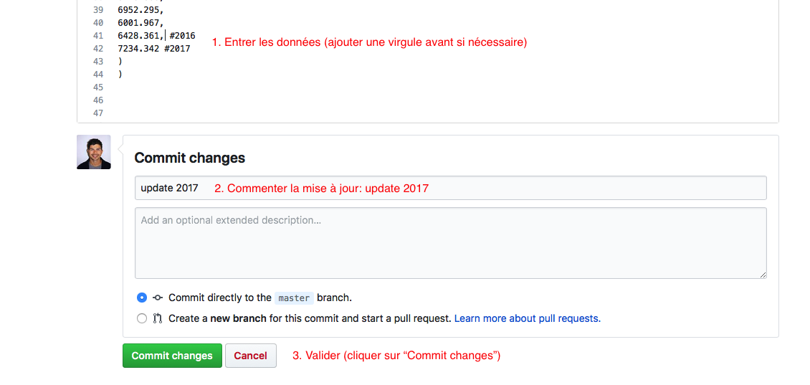

Procedure pour mettre à jour les données
======

1. Cliques sur un fichier (ex. "data_list.txt"") 
2. Pour modifier le fichier, il faut cliquer sur le crayon en haut à droite.

3. Il suffit alors d'ajouter les données en bas à la suite de 2016

4. Il faut alors enregistrer en rentrant un message pour décrire les changements - ici, "update 2017" - puis en cliquant sur le bouton vert "Commit changes".

Si il y un le mondre problème ou question, me contacter: mathieu.buoro@inra.fr
