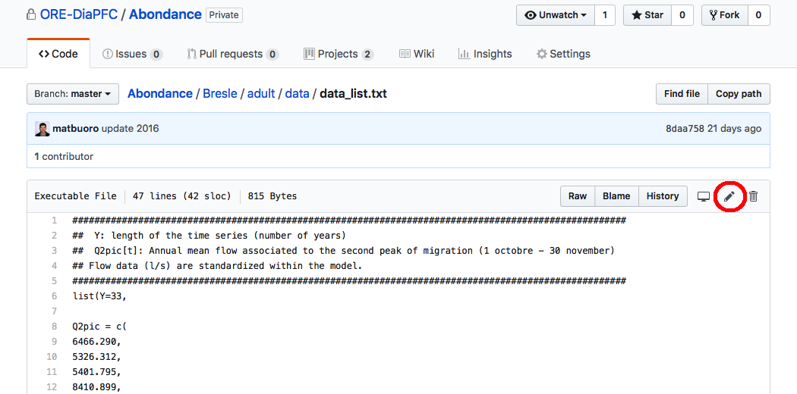

Procedure pour mettre à jour les données
======

/!\ SEULS LES FICHIERS EN .txt SONT A MODIFIER!!!  

1. Cliquer sur un fichier (ex. "*data_list.txt*") 

2. Pour modifier le fichier, il faut cliquer sur le **crayon** en haut à droite.

3. Ajouter les données en bas (à la suite de 2016)

4. Enregistrer en rentrant un message pour décrire les changements - ici, "update 2017". 
Si des corrections ont été apportées et qui concerneraient éventuellement les données avant 2017, merci de décrire les changements effectués dans la section "*Add an optional extended description...*"

5. Valider en cliquant sur le bouton vert "Commit changes".

Si il y un le mondre problème ou question, me contacter: mathieu.buoro@inra.fr
