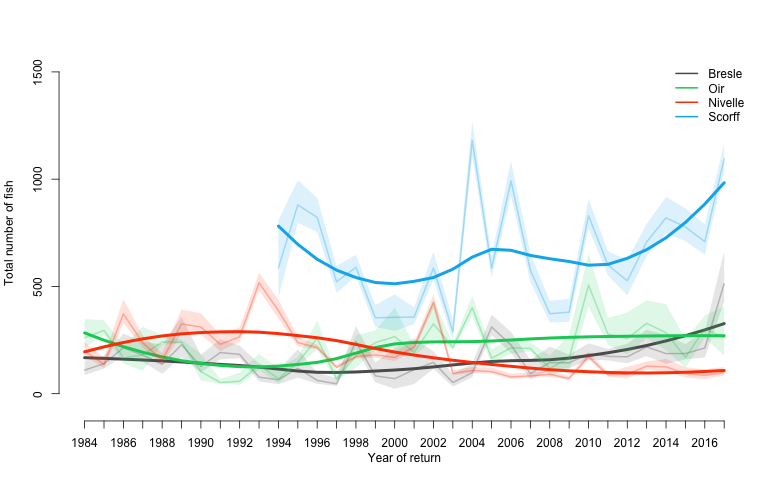

Estimates
======

Estimates of the number of returns (fish of 1 Sea Winter, 2 Sea Winter and Total) are provided for each sites: see csv files.
The file "Total_return_all.csv" combines the estimates of the total number of returns for all sites.

