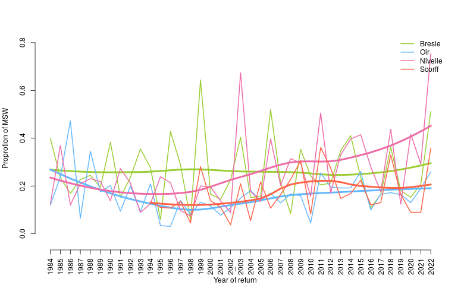
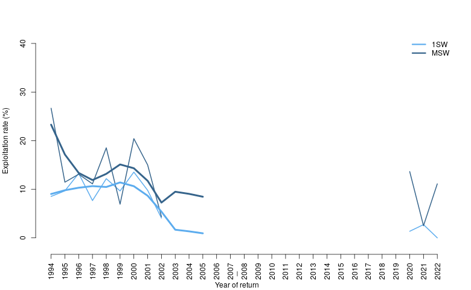

Mise à jour et standardisation des séries chronologiques d'abondance du saumon atlantique sur les cours d'eau de l'ORE DiaPFC
======

Estimates of the number of returns (fish of 1 Sea Winter, 2 Sea Winter and Total) are provided for each sites: see csv files.
The file "Total_return_all.csv" combines the estimates of the total number of returns for all sites.

# ADULTS

  

Figure1: Total number of anadromous adults returning to the river (medians and 95% credible intervals are reported). Evolution trend by loess smoothing.

  

Figure2: Proportion of Multiple Sea Winter returning to the river (only medians are reported). Evolution trend by loess smoothing.

 

Figure3: Exploitation rate in the rivers Scorff (only medians are reported) Evolution trend by loess smoothing.

# SMOLTS
 

Figure4: Total number of smolts (medians and 95% credible intervals are reported). Evolution trend by loess smoothing.

# PARR
 

Figure5: Total number of parr (medians and 95% credible intervals are reported). Evolution trend by loess smoothing.
